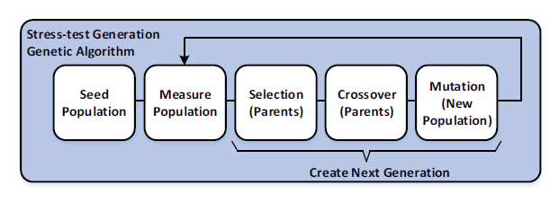

# GeneticStressTestGenerator
 GeneticStressTestGenerator creates stress tests by using the genetic algorithm.
 The project was developed for the [MYY901-Microprocessors](https://www.cse.uoi.gr/course/microprocessors/?lang=en) course [@cse.uoi.gr](https://www.cs.uoi.gr/)
 
 ### About
 The goal of this project is to produce stress tests  that cause 
 the maximum switching activity of a circuit.   
 For the production of the stress test the following genetic algorithm is used:  
 
